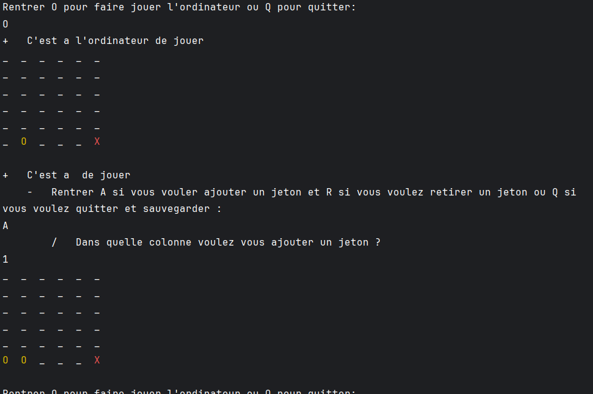

# Puissance N

Puissance N is a console-based game where players take turns to drop tokens into a grid, aiming to align a specified number of tokens to win. The game supports player vs player and player vs computer modes, with varying difficulty levels for the computer opponent.

## Features

- **Player vs Player mode**: Two human players can compete against each other.
- **Player vs Computer mode**: Play against the computer with two difficulty levels:
    - **Easy**: The computer makes random moves.
    - **Hard**: The computer uses a more advanced strategy to block the player and try to win.
- **Save and load game functionality**: Players can save their game progress and load it later.
- **Customizable grid size and winning alignment**: Players can choose the size of the grid and the number of tokens needed to align to win.

## Image of the game


## Getting Started

### Prerequisites

- A C compiler (e.g., GCC)
- Windows OS (for color output)

### Building the Project

1. Clone the repository:
   ```sh
   git clone https://github.com/robsman67/puissance-n.git
   cd puissance-n```
   
2. Compile the source code:
   ```sh
   gcc -o puissance_n main.c Jouer.c IA.c Grille.c Demarrage_partie.c SauvegardeEtchargement.c -lwinmm```
   
### Running the Game

Run the compiled executable to start the game:
```sh
./puissance_n
```
   
# How to Play

- Choose to start a new game or load a saved game.
- Select the game mode:
  - Player vs Player
  - Player vs Computer - Easy
  - Player vs Computer - Hard
- Follow the on-screen prompts to play the game:
  - Players take turns to drop tokens into the grid.
  - The goal is to align a specified number of tokens horizontally, vertically, or diagonally.
  - Players can also remove tokens under certain conditions.
  - The game ends when a player aligns the required number of tokens or the grid is full.

# File Descriptions

- **main.c**: Entry point of the game.
- **Jouer.c** and **Jouer.h**: Contains game logic functions.
- **IA.c** and **IA.h**: Contains AI logic for computer moves.
- **Grille.c** and **Grille.h**: Functions for grid initialization and display.
- **Demarrage_partie.c** and **Demarrage_partie.h**: Functions for game setup.
- **SauvegardeEtchargement.c** and **SauvegardeEtchargement.h**: Functions for saving and loading game state.